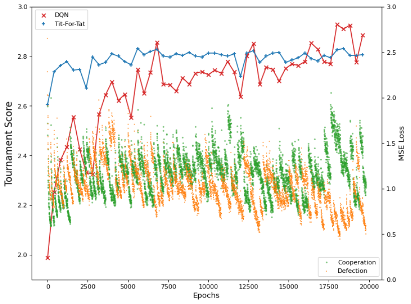

# The-Evolution-of-Defection
A simple deep RL project on iterated prisoner's dilemma by [Harris Zhang](https://github.com/HarrrrisZhang).

#

### Project

The project is divided into 3 stages:

Stage 1: What is DQN and how do they learn? (learn IPD against TitForTat)

Stage 2: Can they learn the optimal strategy (TitForTat)? (play against multiple opponents)

Stage 3: Can DQNs learn from each other? (Multi-Agent Learning)

#

### File structure
<pre>
network.ipynb: 
	examples on using my network module, I would suggest to have a look on this before reading other notebooks

Stage 1, 2, 3 .ipynb:
	notebooks corresponding to each section in the report

AC_prototype.ipynb:
	my attempt on actor-critic algorithm, not yet complete

These are accompanied by 3 folders:

network:
	my homebrew pyTorch for implementing ANNs

axl_utils:
	module to integrate the axl library with my network

data:
	data (csv, ANN, any other objects) generated from the notebooks
</pre>

#

### network module
The network module (inside the network folder) could be used standalone to construct simple ANNs by calling `<import network>`.

This will import the following class objects:
- NeuralNetwork
- Linear_layer
- Activation_layer
- BatchNorm_layer
- Dropout_layer
- Maxout_layer
- Conv1d_layer (it works, buy every pixel in the same kernel gets a similar update, not sure if it is supposed to be so) (stride not yet implemented)

See network.ipynb for details.
