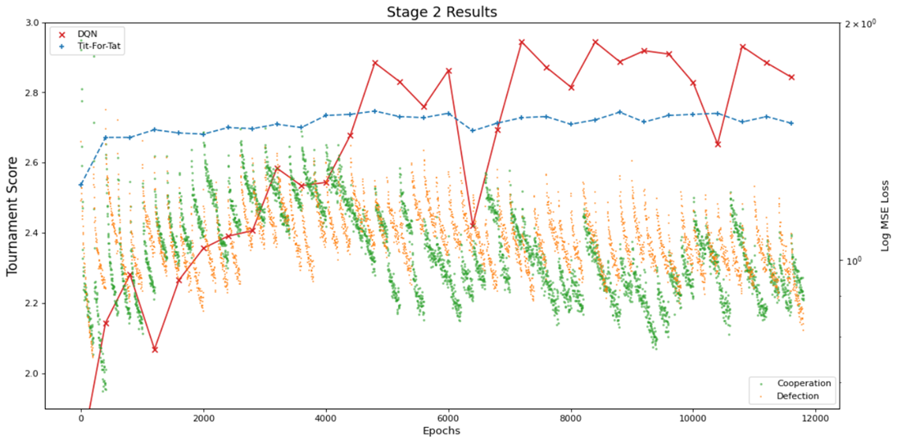

# The-Evolution-of-Defection
A simple deep RL project on iterated prisoner's dilemma.

#

### Project

The projects tries to explore deep Q-learning network's capability in iterated prisoner's dilemma.
It is divided into 3 stages:

Stage 1: Focus on implementing a DQN and investigate how it learns

Stage 2: Can it learn the optimal strategy (TitForTat)? by training against multiple opponents in tournaments

Stage 3: Continue the exploration with distributed multi-agent learning

#

### File structure
<pre>
network.ipynb: 
	examples on using my network module, I would suggest to have a look on this before reading other notebooks

Stage 1, 2, 3 .ipynb:
	notebooks corresponding to each section in the report
    
Stage ... .py:
    training loops from stage 2 or 3, to be runned in terminals for data collections

These are accompanied by 3 folders:

network:
	my homebrew pyTorch/Tensorflow

axl_utils:
	module to integrate the axl library with my network

data:
	data (csv, ANN, any other objects) generated from the notebooks
</pre>

#

### network module
The network module (inside the network folder) could be used standalone to construct simple ANNs by calling `<import network>`.

This will import the following class objects:
- NeuralNetwork
- Linear_layer
- Activation_layer
- BatchNorm_layer
- Dropout_layer
- Maxout_layer
- Conv1d_layer (it works, buy every pixel in the same kernel gets a similar update, not sure if it is supposed to be so) (stride not yet implemented)

See network.ipynb for details.

#
